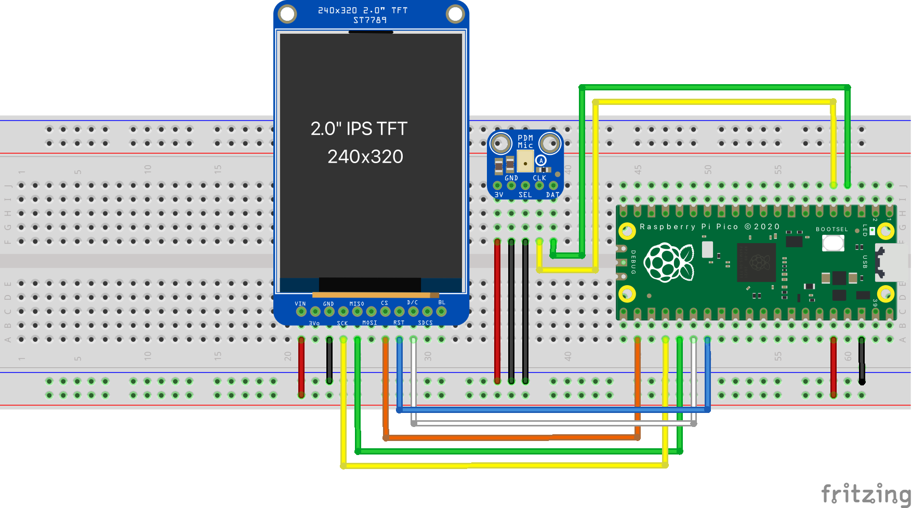

# Audio Spectrogram Example for Pico

Example project showcasing how to use a [Raspberry Pi Pico](https://www.raspberrypi.org/products/raspberry-pi-pico/), [Adafruit's PDM MEMS Microphone Breakout](https://www.adafruit.com/product/3492), and [Adafruit's 2.0" 320x240 Color IPS TFT Display with microSD Card Breakout](https://www.adafruit.com/product/4311) to "See sound in real-time".

This project also leverages Arm's [CMSIS-DSP](https://arm-software.github.io/CMSIS_5/DSP/html/index.html) library for optimized on-board digital signaling processing.

## Hardware

 * [Raspberry Pi Pico](https://www.raspberrypi.org/products/raspberry-pi-pico/)
 * [Adafruit's PDM MEMS Microphone Breakout](https://www.adafruit.com/product/3492)
 * [Adafruit's 2.0" 320x240 Color IPS TFT Display with microSD Card Breakout](https://www.adafruit.com/product/4311)


### Default Pinout



```
+---------+-------------------+     +---------+-------------------+
| PDM Mic | Raspberry Pi Pico |     | ST7789  | Raspberry Pi Pico |
|---------+-------------------|     |---------+-------------------|
|    3V   |        3V3        |     |   VIN   |        3V3        |
|---------+-------------------|     |---------+-------------------|
|    GND  |        GND        |     |   GND   |        GND        |
|---------+-------------------|     |---------+-------------------|
|    SEL  |        GND        |     |   SCK   |      GPIO18       |
|---------+-------------------|     |---------+-------------------|
|    DAT  |       GPIO2       |     |   MOSI  |      GPIO19       |
|---------+-------------------|     |---------+-------------------|
|    CLK  |       GPIO3       |     |   CS    |      GPIO17       |
+---------+-------------------+     |---------+-------------------|
                                    |   RST   |      GPIO21       |
                                    |---------+-------------------|
                                    |   D/C   |      GPIO20       |
                                    +---------+-------------------+
```

## Cloning

```sh
git clone --recurse-submodules https://github.com/ArmDeveloperEcosystem/audio-spectrogram-example-for-pico.git
```

## Building

1. [Set up the Pico C/C++ SDK](https://datasheets.raspberrypi.org/pico/getting-started-with-pico.pdf)
2. Set `PICO_SDK_PATH`
```sh
export PICO_SDK_PATH=/path/to/pico-sdk
```
3. Change directories
```
cd audio-spectrogram-example-for-pico
```
4. Create `build` dir, run `cmake` and `make`:
```
mkdir build
cd build
cmake .. -DPICO_BOARD=pico
make -j
```
4. Copy `audio_spectrogram.uf2` to Pico when in BOOT mode.

## License

[Apache-2.0 License](LICENSE)

---

Disclaimer: This is not an official Arm product.
